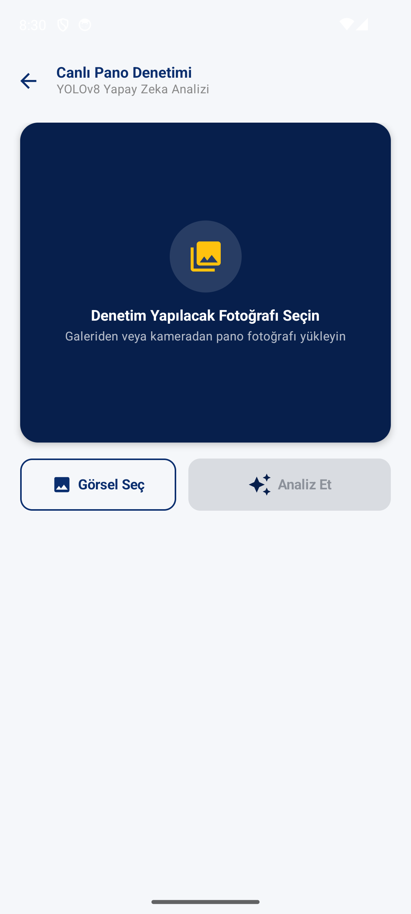

# PanoKontrol (GridCheck) ⚡🤖

 *(Proje önizleme görsellerini buraya ekleyebilirsiniz)*

**PanoKontrol**, Enerjisa dağıtım panolarının denetim süreçlerini dijitalleştirmek ve hızlandırmak amacıyla geliştirilmiş, **YOLOv8** tabanlı yapay zeka analiz destekli bir Android uygulamasıdır. Sahadaki teknisyenlerin, dağıtım panolarının fotoğraflarını çekerek saniyeler içinde içindeki ekipmanların doğruluğunu, uyarı levhalarının varlığını ve SAP kod eşleşmelerini kontrol etmesini sağlar.

---

## 🌟 Öne Çıkan Özellikler

*   **Yapay Zeka Destekli Analiz (YOLOv8):** Pano içindeki sigorta gruplarını (400A, 250A, 160A DSYA), baraları, klemensleri ve tehlike levhalarını yüksek doğrulukla tespit eder.
*   **Otomatik SAP Kodu Eşleşmesi:** Tespit edilen sigorta gruplarının kombinasyonuna göre doğru **SAP Malzeme Kodunu** otomatik olarak önerir.
*   **Toplu Denetim Akışı:** Dış kapak, ürün etiketi ve iç kısım fotoğraflarının toplu olarak yüklenip tek seferde analiz edilmesini sağlayan optimize edilmiş kullanıcı deneyimi (Inspection Flow).
*   **Modern ve Hızlı Kullanıcı Arayüzü:** %100 **Jetpack Compose** ile geliştirilmiş, Material Design 3 standartlarına uygun profesyonel ekranlar.
*   **Lazer Tarama Simülasyonu:** Bekleme sürelerini kullanıcı dostu hale getiren, görsel olarak zenginleştirilmiş analiz animasyonları.
*   **Ölçeklenebilir API Entegrasyonu:** FastAPI tabanlı uzak sunucu ile haberleşen hızlı ve güvenilir Retrofit altyapısı.

---

## 🛠 Kullanılan Teknolojiler & Mimari

Uygulama, modern Android geliştirme standartlarına uygun olarak inşa edilmiştir:

*   **Programlama Dili:** Kotlin
*   **Kullanıcı Arayüzü (UI):** Jetpack Compose, Material 3
*   **Asenkron İşlemler:** Kotlin Coroutines
*   **Navigasyon:** Navigation Compose
*   **Ağ (Network) İşlemleri:** Retrofit 2, OkHttp 4
*   **Görsel Yükleme & İşleme:** Coil Compose
*   **JSON Parse:** Gson Converter
*   **Yapay Zeka (Backend):** YOLOv8 (Python, FastAPI / Flask tabanlı API)

---

## 🚀 Kurulum & Çalıştırma

### 1. Gereksinimler
*   Android Studio (Iguana veya üzeri önerilir)
*   Android SDK 35 (Hedef API) ve Min SDK 24
*   Aktif bir Ngrok (veya doğrudan sunucu) API bağlantısı

### 2. Projeyi Çalıştırma
1. Depoyu yerel ortamınıza klonlayın:
   ```bash
   git clone https://github.com/company/panokontrol.git
   ```
2. **Android Studio** ile projeyi açın.
3. Gradle senkronizasyonunun tamamlanmasını bekleyin.
4. `ApiClient.kt` dosyasındaki `BASE_URL` değişkenini aktif API sunucu adresiniz ile güncelleyin:

   > 💡 **Not:** Ngrok bağlantısı Eray tarafından kurulmuştur. Farklı bir sunucuya veya yeni bir ngrok oturumuna bağlanmak isterseniz, aşağıdaki URL'yi kendi sunucu adresinizle değiştirmeniz gerekmektedir.

   ```kotlin
   // app/src/main/java/com/panokontrol/gridcheck/ApiClient.kt
   const val BASE_URL = "https://<GUNCEL_NGROK_ADRESI>.ngrok-free.dev/"
   ```
5. Projeyi bir emülatörde veya fiziksel Android cihazında (Android 7.0+) çalıştırın.

---

## 📁 Proje Yapısı

*   `app/src/main/java/com/panokontrol/gridcheck/`
    *   `ui/` - Jetpack Compose ekranları, navigasyon (NavGraph) ve temalandırma.
    *   `ui/screens/inspection/` - Toplu analiz ve denetim akışı ekranları.
    *   `ui/screens/test/` - Canlı yapay zeka tespit (API test) ekranları.
    *   `ApiClient.kt` - Retrofit tanımlamaları, API modelleri ve Ngrok bağlantı ayarları.
    *   `Utils.kt` (veya ilgili sınıflar) - SAP kod eşleştirme algoritmaları ve iş mantığı.

---

## 🔒 Veri Gizliliği ve Güvenlik
Proje içerisindeki çekilen pano fotoğrafları kalıcı olarak depolanmaz. Yalnızca analiz süresince geçici (cache) dizininde tutulur ve analiz tamamlandıktan sonra ağ üzerinden aktarılır. Kullanıcı verileri KVKK yönergeleriyle uyumlu bir şekilde işlenmektedir.

---

**Geliştirici:** Eray (PanoKontrol Geliştirme Ekibi)
**Versiyon:** 1.0.0
**Telif Hakkı:** © 2026 Enerjisa & PanoKontrol
